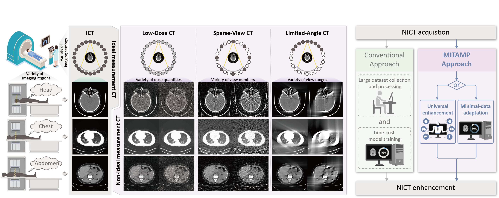

<!-- # :dragon_face: MITAMP - An imaging foundation model -->
[]()
--- 
[](https://github.com/YutingHe-list/MITAMP/blob/main/document/Model_zoom.md)
[](https://huggingface.co/datasets/YutingHe-list/SimNICT)

:loudspeaker: MITAMP paper - "[Imaging foundation model for universal enhancement of non-ideal measurement CT](***)".

## News
- 2024.09.25: Open a [MITAMP-adapted Model Zoo](https://github.com/YutingHe-list/MITAMP/blob/main/document/Model_zoom.md) to release the adapted MITAMP in different downstream tasks.
- 2024.09.18: Release the adaptation code of MITAMP together with a [simple dataset](https://seunic-my.sharepoint.cn/personal/220232198_seu_edu_cn/_layouts/15/onedrive.aspx?id=%2Fpersonal%2F220232198%5Fseu%5Fedu%5Fcn%2FDocuments%2FMITAMP%2FSimNICT%2DAMOS%2DSimple&ga=1) for quick start.
- 2024.09.15: Release the **MITAMP** official code for universal NICT enhancement. Welcome to use! [[Paper](***)]

## Brief introduction 
Non-ideal measurement computed tomography (NICT), which sacrifices optimal imaging standards for new advantages in CT imaging, is expanding the clinical application scope of CT images. However, with the reduction of imaging standards, the image quality has also been reduced, extremely limiting the clinical acceptability. We propose a **M**ulti-scale **I**ntegrated **T**ransformer **AMP**lifier (**MITAMP**), the first imaging foundation model for universal NICT enhancement. It has been pre-trained on a large-scale physical-driven simulation dataset, and is able to directly generalize to the NICT enhancement tasks with various non-ideal settings and body regions. Via the adaptation with few data, it can further achieve professional performance in real-world specific scenarios.
<p align="center">

## [MITAMP-adapted Model Zoo](https://github.com/YutingHe-list/MITAMP/blob/main/document/Model_zoom.md)
We are hosting a [Model Zoo](https://github.com/YutingHe-list/MITAMP/blob/main/document/Model_zoom.md) to release the adapted MITAMP in different downstream tasks.

- You can try to find an adapted MITAMP that meets the requirement of your target task, and it will have better performance.
- If you want to contribute to the Model Zoo, please send the [EMAIL](mailto:ythe1995@163.com) to our group.


https://github.com/user-attachments/assets/4016964e-828c-4ca6-816b-47e502ff53fc


## Demo
Waitting
<!-- ## Acknowledgements
- We highly appreciate -->

## Reference
```
Waitting
```

## Ongoing
- [ ] Release SimNICT dataset with 10.6 million NICT-ICT image pairs.
- [ ] Release pre-training code of MITAMP.
- [ ] MITAMP Toolbox on 3D Slicer.
- [x] Open a MITAMP-adapted Model Zoo.
- [x] Release adaptation code of MITAMP-S.
- [x] Release inference code and pretrained weights of MITAMP.

# :running: Playground: Quick start MITAMP
- [ ] You can try the MITAMP via the [Jupeter Notebook](). 
- [x] You can implement the MITAMP on your server via the following operations.

## 1. Clone the repository and prepare environment

### Dependencies
- Python 3.10.11
- PyTorch 2.0.1
  
**Step 1**: Clone the repository
```bash
git clone https://github.com/YutingHe-list/MITAMP
cd MITAMP/
pip install -r requirements.txt
```

**Step 2**: Install the [Adan](https://github.com/sail-sg/Adan) and [ODL](https://github.com/odlgroup/odl) packages by following the recommended procedures.

- **Adan**

Use `which nvcc` to locate the environment where CUDA is installed (e.g., `/usr/local/cuda/bin/nvcc`), and then modify and execute the following commands based on that path:

```bash
export CUDA_HOME=/usr/local/cuda   # Path to your environment with CUDA installed
export PATH=$CUDA_HOME/bin:$PATH
export LD_LIBRARY_PATH=$CUDA_HOME/lib64:$LD_LIBRARY_PATH
python3 -m pip install git+https://github.com/sail-sg/Adan.git
```

- **ODL**

Install the ODL package by following the steps below:
```bash
pip install odl
```
Next, clone the ODL repository and overwrite the contents of the odl folder in your MITAMP environment (.e.g, `/home/xytc/anaconda3/envs/MITAMP/lib/python3.10/site-packages/odl`)with the files from the `odl/odl` folder in the cloned repository.

## 2. Download the pre-trained MITAMP
<!-- need added: one in paper, one for recent -->
| Weight     | Download  | Description                           |
|------------|-----------|---------------------------------------|
| MITAMP_pretrain.pkl | [link](https://seunic-my.sharepoint.cn/:u:/g/personal/220232198_seu_edu_cn/EYkIR7NFZIRPoU8sMgr9A9MBKDQyEg91-43OSGLMvL4fFQ?e=2xsa3w) |Pre-trained universal NICT enhancement model|

Download the model checkpoint and save it to `./weights/MITAMP_pretrain_weight/MITAMP_pretrain.pkl`.

## Option: A simple dataset for quick start
We have provided a [simple simulation-based dataset](https://seunic-my.sharepoint.cn/personal/220232198_seu_edu_cn/_layouts/15/onedrive.aspx?id=%2Fpersonal%2F220232198%5Fseu%5Fedu%5Fcn%2FDocuments%2FMITAMP%2FSimNICT%2DAMOS%2DSimple&ga=1) form a part of [AMOS](https://amos22.grand-challenge.org/) dataset for quick start. If you want to test the MITAMP on NICT volumes or try the adaptation, you can download the testing data and the training data with different NICT settings in specific folds.

## 3. Universal enhancement
For your convenience, we provide two testing modes to demonstrate the universal NICT enhancement performance of MITAMP:
- [Slice testing](#31-slice-testing) enhances 2D NIFTI data with the shape [1, H, W].
- [Volume testing](#32-volume-testing) enhances 3D NIFTI data with the shape [S, H, W].

### 3.1 Slice testing

**Step 1**: We have provided testing data in the `./samples/slice_testing/input` directory with the shape [1, H, W]. You can also use your own data by placing it in this directory. 

**Step 2**: To enhance **a single NICT slice file** specified by `--input_path` using MITAMP, execute the following command. The enhanced slice file will be saved at `--output_path`.

```bash
python inference.py --testing_mode "single_slice" --input_path "samples/slice_testing/input/LDCT_Low.nii.gz" --output_path "samples/slice_testing/output/LDCT_Low.nii.gz" --LoRA_mode "none"
```

To enhance **all NICT slice files** in the `--input_folder` directory using MITAMP, execute the following command. The enhanced slice files will be saved in `--output_folder` with the same name.

```bash
python inference.py --testing_mode "group_slice" --input_folder "samples/slice_testing/input" --output_folder "samples/slice_testing/output" --LoRA_mode "none"
```

### 3.2 Volume testing
**Step 1**: You can put the [testing data](#option-a-simple-dataset-for-quick-start) with the shape [S, H, W] or use your own data by placing it in the `./samples/volume_testing/input` directory. 

**Step 2**: To enhance **a single NICT volume file** specified by `--input_path` using MITAMP, execute the following command. The enhanced volume will be saved at `--output_path`.

```bash
python inference.py --testing_mode "single_volume" --input_path "samples/volume_testing/input/1.nii.gz" --output_path "samples/volume_testing/output/1.nii.gz" --LoRA_mode "none"
```

To enhance **all NICT volume files** in the `--input_folder` directory using MITAMP, execute the following command. The enhanced volume files will be saved in `--output_folder` with the same name.

```bash
python inference.py --testing_mode "group_slice" --input_folder "samples/volume_testing/input" --output_folder "samples/volume_testing/output" --LoRA_mode "none"
```

##  4. Adaptation with LoRA
We provide the MITAMP-S adaptation method for specific NICT enhancement tasks in the [4.1 Model adaptation](#41-model-adaptation) section, followed by the corresponding [4.2 Slice testing](#42-slice-testing) and [4.3 Volume testing](#43-volume-testing) sections to demonstrate the performance of the adapted MITAMP-S.


### 4.1 Model adaptation
**Step 1**: We provide [training data](#option-a-simple-dataset-for-quick-start) for MITAMP adaptation. Download the NICT volumes from a specific NICT type folder and place them in the `./samples/adaptation/input` directory. Then, download the corresponding label volumes with the same name and place them in the `./samples/adaptation/label` directory.

**Step 2**: Execute the following command to fine-tune MITAMP-S to adapt to the specific training data located in the `"input_folder"` and `"label_folder"`, with the number of volumes set by `"training_volumes"`. The parameters `"queue_len"` and `"queue_iterate_times"` control the sampling method for the training data, consistent with the method described in the paper. The LoRA weights of MITAMP-S will be stored in the `./weights/LoRA_weight` directory.

```bash
python adaptation_LoRA.py --input_folder "samples/adaptation/input" --label_folder "samples/adaptation/label" --training_volumes 44 --queue_len 5 --queue_iterate_times 2
```

### 4.2 Slice testing
**Step 1**: We have provided testing data in the `./samples/slice_testing/input` directory, which is the same data used in the [3.1 Slice testing](#31-slice-testing) section. You can also use your own data by placing it in this directory. 

**Step 2**: To enhance **a single NICT slice file** specified by `--input_path` using MITAMP-S, execute the following command. The LoRA weight file is specified by `"LoRA_path"`, and the enhanced slice file will be saved at `--output_path`.

```bash
python inference.py --testing_mode "single_slice" --input_path "samples/slice_testing/input/LDCT_Low.nii.gz" --output_path "samples/slice_testing/output/LDCT_Low.nii.gz" --LoRA_mode "load" --LoRA_path "weights/MITAMP_adaptation_weight/LoRA_88.pkl"
```

To enhance **all NICT slice files** in the `--input_folder` directory using MITAMP-S, execute the following command. The enhanced slice files will be saved in `--output_folder` with the same name.

```bash
python inference.py --testing_mode "group_slice" --input_folder "samples/slice_testing/input" --output_folder "samples/slice_testing/output" --LoRA_mode "load" --LoRA_path "weights/MITAMP_adaptation_weight/LoRA_88.pkl"
```

### 4.3 Volume testing

**Step 1**: The [testing data](#option-a-simple-dataset-for-quick-start) with the shape [S, H, W] is the same as that used in the [3.2 Volume testing](#32-volume-testing) section. Download and place them in the `./samples/volume_testing/input` directory, or use your own data by placing it in the same directory.

**Step 2**: To enhance **a NICT volume file** specified by `--input_path` using MITAMP-S, execute the following command. The LoRA weight file is specified by `"LoRA_path"`, and the enhanced volume file will be saved at `--output_path`.

```bash
python inference.py --testing_mode "single_volume" --input_path "samples/volume_testing/input/1.nii.gz" --output_path "samples/volume_testing/output/1.nii.gz" --LoRA_mode "load" --LoRA_path "weights/MITAMP_adaptation_weight/LoRA_88.pkl"
```

To enhance **all NICT volume files** in the `--input_folder` directory using MITAMP-S, execute the following command. The enhanced volume files will be saved in `--output_folder` with the same name.

```bash
python inference.py --testing_mode "group_volume" --input_folder "samples/volume_testing/input" --output_folder "samples/volume_testing/output" --LoRA_mode "load" --LoRA_path "weights/MITAMP_adaptation_weight/LoRA_88.pkl"
```

