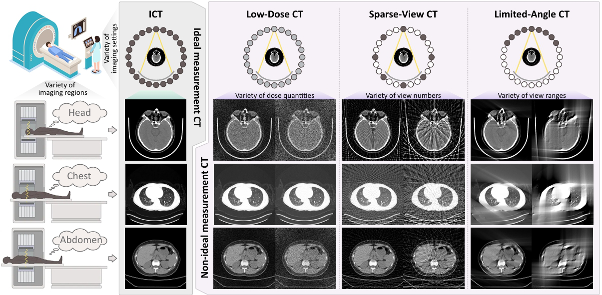

# MITAMP
The official code of MITAMP paper - "[Imaging foundation model for universal enhancement of non-ideal measurement CT](***)". 

Non-ideal measurement computed tomography (NICT), which sacrifices optimal imaging standards for new advantages in CT imaging, is expanding the clinical application scope of CT images. However, with the reduction of imaging standards, the image quality has also been reduced, extremely limiting the clinical acceptability. We propose a **M**ulti-scale **I**ntegrated **T**ransformer **AMP**lifier (**MITAMP**), the first imaging foundation model for universal NICT enhancement. It has been pre-trained on a large-scale physical-driven simulation dataset, and is able to directly generalize to the NICT enhancement tasks with various non-ideal settings and body regions. Via the adaptation with few data, it can further achieve professional performance in real-world specific scenarios.

<p align="center"></p>

## News
- 2024.09.15: Release a large-scale simulated NICT dataset, **SimNICT**, with 3.6 million image pairs. [[Dataset](https://huggingface.co/datasets/YutingHe-list/SimNICT)]
- 2024.09.15: Release the **MITAMP** official code for universal NICT enhancement. Welcome to use and evaluate! [[Paper](***)] 

## Installation
1. Create a virtual environment `conda create -n medsam python=3.10 -y` and activate it `conda activate medsam`;
2. Install [Pytorch 2.0](https://pytorch.org/get-started/locally/);
3. `git clone https://github.com/YutingHe-list/MITAMP`;
4. Enter the MedSAM folder `cd MITAMP` and run `pip install -e`.

## Get Start
Download the [model checkpoint](https://) and place it at e.g., `work_dir/MITAMP/mitamp`

## Model Training

### Data Preprocessing

## Acknowledgements
- We highly appreciate

## Reference
```
Waitting
```

## Ongoing
- [ ] Release SimNICT dataset with 10.6 million NICT-ICT image pairs.
- [ ] Release training code of MITAMP.
- [ ] Release adaptation code of MITAMP-S.
- [x] Release inference code and pretrained weights of MITAMP.
