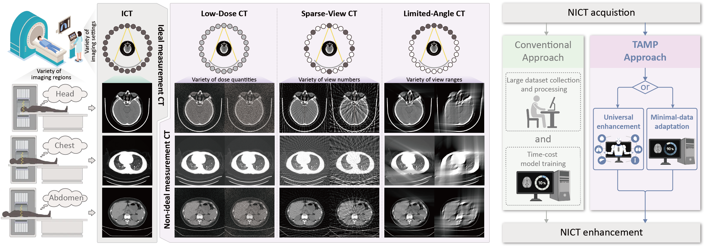

# MITAMP
The official code of MITAMP paper - "[Imaging foundation model for universal enhancement of non-ideal measurement CT](***)". 

Non-ideal measurement computed tomography (NICT), which sacrifices optimal imaging standards for new advantages in CT imaging, is expanding the clinical application scope of CT images. However, with the reduction of imaging standards, the image quality has also been reduced, extremely limiting the clinical acceptability. We propose a **M**ulti-scale **I**ntegrated **T**ransformer **AMP**lifier (**MITAMP**), the first imaging foundation model for universal NICT enhancement. It has been pre-trained on a large-scale physical-driven simulation dataset, and is able to directly generalize to the NICT enhancement tasks with various non-ideal settings and body regions. Via the adaptation with few data, it can further achieve professional performance in real-world specific scenarios.

<p align="center"></p>

## News
- 2024.09.15: Release a large-scale simulated NICT dataset, **SimNICT**, with 3.6 million image pairs. [[Dataset](https://huggingface.co/datasets/YutingHe-list/SimNICT)]
- 2024.09.15: Release the **MITAMP** official code for universal NICT enhancement. Welcome to use and evaluate! [[Paper](***)] 

## Dependecies
- Python 3.10.11
- PyTorch 2.0.1

## Usage of the pre-trained Models MITAMP
## 1. Clone the repository
<!-- 这里还要准备个最简单的环境 -->
```bash
$ git clone https://github.com/YutingHe-list/MITAMP
$ cd 
$ pip install -r requirements.txt
```

## 2. Download the pre-trained Models MITAMP
Download the [model checkpoint](https://seunic-my.sharepoint.cn/:f:/g/personal/220232198_seu_edu_cn/EoVQNIe_E0RAnfDCJXsplHoBDe9kbq-3eAbRBMlliMjxTA?e=ccZe8r) and save it to `./models/foundation_model_weight/MITAMP.pkl`.

## 3. Model Testing
For your convenience, we provide three test modes to demonstrate the performance of MITAMP. 
- To gain a quick understanding of our foundational model's universal NICT enhancement capabilities, the [slice testing](#31-slice-testing) is recommended. 
- More test data is provided in the [volume testing](#32-volume-testing). 
- In the [adaptation testing](#33-adaptation-testing), we provide training data for nine types of NICT and the MITAMP fine-tuning code, used to test its adaptation capability for specific NICT enhancement tasks.

### 3.1 Slice testing
Nine types of NICT images are provided in the `./samples/slice_test/input` directory for a simple test of MITAMP's universal enhancement capability. Execute the following command. The MITAMP-enhanced output will be stored in `./samples/slice_test/output`
```bash
python main.py --test_pattern "slice_test"
```

### 3.2 Volume testing
We have provided additional NICT data for testing purposes. 

**Step 1**: Download the [testing data](https://seunic-my.sharepoint.cn/:f:/g/personal/220232198_seu_edu_cn/EoXbDCJ9XYBKhzx72KVfWWQBGeFWqbIzT0MJWUXYOSB1Ag?e=QXqJ66), which includes 11 volumes for each of the 9 types of NICT data, and place them in the `./samples/volume_test/input` directory.

**Step 2**: Execute the following command. The MITAMP-enhanced output will be stored in `./samples/volume_test/output`
```bash
python main.py --test_pattern "volume_test"
```

### 3.3 Fine-tuning and testing
We have provided specific NICT-type fine-tuning data along with the MITAMP fine-tuning and testing code. 

**Step 1**: Download the [fine-tuning data](https://seunic-my.sharepoint.cn/:f:/g/personal/220232198_seu_edu_cn/EuhW8PS-H2ZApQdw9odb-5MB96Q-XZw4N3JGhK3q7ZIc2A?e=k4rlON), which includes 44 volumes for each of the 9 types of NICT data , and place them in the `./samples/fine-tuning_test` directory. 

**Step 2**: Execute the following command to fine-tune MITAMP on a specific category of NICT data, where the parameter 'NICT_setting' can be set to 'LDCT', 'LACT', or 'SVCT', and the parameter 'defect_degree' can be set to 'Low', 'Mid', or 'High'. The fine-tuned LoRA weights will be stored in the corresponding `./models/fine-tune_LoRA_weight` directory. 
```bash
python main.py --test_pattern "fine_tuning" --NICT_setting "LDCT" --defect_degree "Low"
```

**Step 3**: 


## Acknowledgements
- We highly appreciate

## Reference
```
Waitting
```

## Ongoing
- [ ] Release SimNICT dataset with 10.6 million NICT-ICT image pairs.
- [ ] Release pre-training code of MITAMP.
- [x] Release adaptation code of MITAMP-S.
- [x] Release inference code and pretrained weights of MITAMP.
